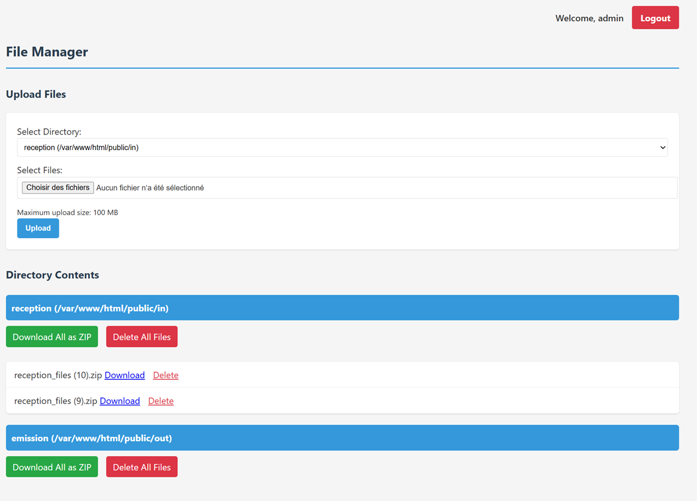

# Flux - Simple File Manager

⚠️ Still in dev. Made quickly in a aftenoon.

Flux is a lightweight, PHP-based file management system that allows for easy upload, download, and management of files across multiple directories.



## Features

- **Secure Authentication**: Login system to protect your files
- **Multiple Directory Support**: Configure and manage files across multiple directories
- **File Operations**:
  - Upload multiple files at once
  - Download individual files
  - Download all files from a directory as a ZIP archive
  - Delete files individually or clear entire directories
- **Validation**: File type and size validation for uploads
- **Responsive Design**: User-friendly interface that works on desktop and mobile devices

## Installation

1. Clone the repository to your web server:

   ```
   git clone https://github.com/willi-esti/file_upload
   ```

2. Make sure PHP is installed on your server (7.4+ recommended)

3. Ensure the following PHP extensions are enabled:

   - fileinfo (for MIME type detection)
   - session (for authentication)
   - zip (for downloading directories as ZIP)

4. Install dependencies using Composer:

   ```
   cd flux
   composer install
   ```

5. Set appropriate permissions for upload directories

## Configuration

1. Copy the `.env.example` file to `.env` and configure your settings:

   ```
   cp .env.example .env
   ```

2. Edit the `.env` file with your credentials and file configurations:

   ```
   # Admin credentials
   ADMIN_USERNAME=your_username
   ADMIN_PASSWORD=your_secure_password

   # Allowed file extensions and MIME types
   ALLOWED_EXTENSIONS=[".jpg",".jpeg",".png",".gif",".pdf",".doc",".docx",".txt"]
   ALLOWED_MIME_TYPES=["image/jpeg","image/png","image/gif","application/pdf","application/msword","application/vnd.openxmlformats-officedocument.wordprocessingml.document","text/plain"]
   ```

3. Configure your directories in the `utils/config.php` file

## Usage

1. Access the application via your web server (e.g., `http://yourdomain.com/flux/public/`)
2. Log in using your configured admin credentials
3. Upload files by selecting a target directory and choosing files
4. Manage uploaded files through the user interface
5. Log out when finished to secure your files
